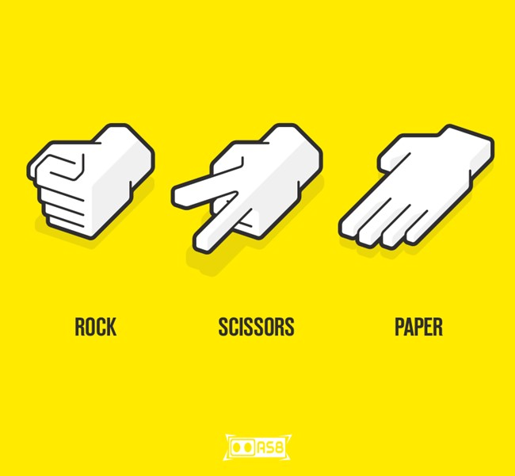

# _Rock-Paper-Scissors_
GUI based Rock-Paper-Scissors game created using Pygame. You can play this game just by clicking on the GUI window. Several facilities of rock-paper-scissors are simmilar to the Head-Tail game which I have created before

# Features
* Graphical User Interface with pygame.
* Smooth Sound and Musics.
* Score meter.
* Minimal design.
* Mouse based input system.
* Target chooser.
* Several bug fixes.

# How to use
* Download [Python](https://www.python.org/downloads/) in your device.
* Download the [Zip file](https://codeload.github.com/ahammadshawki8/Rock-Paper-Scissors/zip/main).
* Extract the zip file.
* Download pygame in your device by writing _pip download pygame_ in the command prompt. details can be found in [Pygame website](https://www.pygame.org).
* Open the __rock-paper-scissors_GUI.py__ file with Python Shell.
* Play the game and enjoy.

# License
Details can be found in [LICENSE](LICENSE)
